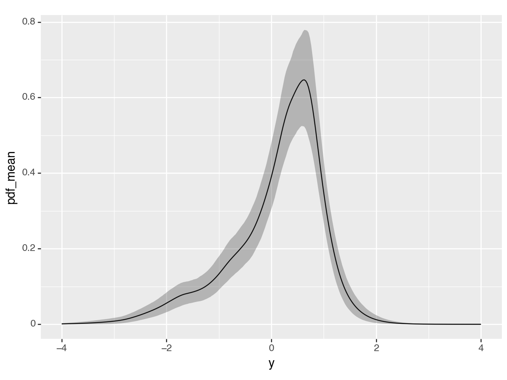

# Bayesian Penalized Transformation Models in Liesel

[](https://github.com/liesel-devs/liesel-ptm/actions/workflows/pre-commit.yml)
[](https://github.com/liesel-devs/liesel-ptm/actions/workflows/pytest.yml)
[](https://github.com/liesel-devs/liesel-ptm/actions/workflows/pytest.yml)
[](https://github.com/liesel-devs/liesel-ptm/actions/workflows/docs.yml)

## Overview

`liesel_ptm` is a library for Bayesian penalized transformation models
(PTMs) for location and scale. Here’s a quick overview:

- The basic model is
  $Y = \mu(\boldsymbol{x}) + \sigma(\boldsymbol{x}) \varepsilon$.
- The location $\mu(\boldsymbol{x})$ and scale $\sigma(\boldsymbol{x})$
  are modeled through structured additive predictors, incorporating a
  wide range of linear, nonlinear, mixed, and spatial effects in a
  basis-function framework.
- Inference is conducted using Markov chain Monte Carlo methods.
- The library is built on top of the probabilistic programming framework
  Liesel. For more on Liesel, see [the Liesel
  documentation](https://docs.liesel-project.org/en/latest/) and [the
  Liesel GitHub repository](https://github.com/liesel-devs/liesel).

## Installation

The library can be installed from GitHub:

``` bash
pip install git+https://github.com/liesel-devs/liesel-ptm.git#egg=liesel_ptm
```

## Example usage

To demonstrate how the individual parts can be used together, you can
find an example using one covariate below. Specifically, we fit the
model:

$$
Y_i = \mu(x_i) + \sigma(x_i) \varepsilon_i, \qquad \mathbb{P}(\varepsilon \leq \varepsilon_i) = \Phi(h(\varepsilon_i)),
$$

where we have

- $i = 1, \dots, N$,
- $\mu(x_i) = \beta_0 + \beta_1 x_i$,
- $\sigma(x_i) = \exp(\gamma_0 + \gamma_1 x_i)$, and
- $h$ an extrapolated, monotonically increasing transformation function
  with shape parameters
  $\boldsymbol{\delta} = [\delta_1, \dots, \delta_{J-1}]^{\mathsf{T}}$
  as defined in the corresponding paper.

As far as priors are concerned:

- We use constant priors for $\beta_1$ and $\gamma_1$ here, and a
  first-order random walk prior with variance parameter
  $\tau^2_{\delta}$ for $\boldsymbol{\delta}$.
- The variance parameter hyperprior is set to
  $\tau^2_{\delta} \sim \text{Weibull}(0.5, 0.05)$.

### Setup

``` python
import liesel_ptm as ptm
import liesel.goose as gs

data = ptm.example_data(seed=1812, n=100)
```

### Model definition

``` python
tau2 = ptm.VarWeibull(value=1.0, scale=0.05, name="tau2_delta")

model = ptm.PTMLocScale.from_nparam(
  y=data.y.to_numpy(),
  nparam=30, # J = 30
  normalization_tau2=tau2
)

model.loc_model += ptm.LinearTerm(x=data.x0.to_numpy(), name="x0_loc")
model.log_scale_model += ptm.LinearTerm(x=data.x0.to_numpy(), name="x0_scale")
```

### Pre-optimization

``` python
model, position = model.optimize_knots()
graph = model.build_graph(position=position)
```

    liesel.model.model - INFO - Converted dtype of Data(name="x0_scale_coef_value").value
    liesel.model.model - INFO - Converted dtype of Data(name="x0_loc_coef_value").value
    liesel.model.model - INFO - Converted dtype of Data(name="normalization_shape_transformed_value").value
    liesel_ptm.ptm_ls - INFO - Optimizing 2 parameters.
    liesel_ptm.ptm_ls - INFO - Finished optimization after 261 iterations.
    liesel.model.model - INFO - Converted dtype of Data(name="normalization_shape_transformed_value").value
    liesel_ptm.ptm_ls - INFO - Optimizing parameter block #1 (len=3).
    liesel_ptm.ptm_ls - INFO - Finished optimization after 631 iterations.

### MCMC Sampling

``` python
eb = gs.EngineBuilder(seed=1819, num_chains=4)
eb = model.setup_engine_builder(eb=eb, graph=graph)
eb.set_duration(warmup_duration=1000, posterior_duration=1000)

engine = eb.build()
engine.sample_all_epochs()

results = engine.get_results()
samples = results.get_posterior_samples()
```

    liesel.goose.builder - WARNING - No jitter functions provided. The initial values won't be jittered
    liesel.goose.engine - INFO - Initializing kernels...
    liesel.goose.engine - INFO - Done
    liesel.goose.engine - INFO - Starting epoch: FAST_ADAPTATION, 75 transitions, 25 jitted together
    liesel.goose.engine - WARNING - Errors per chain for kernel_01: 0, 1, 1, 0 / 75 transitions
    liesel.goose.engine - WARNING - Errors per chain for kernel_02: 3, 2, 2, 2 / 75 transitions
    liesel.goose.engine - WARNING - Errors per chain for kernel_03: 1, 4, 1, 3 / 75 transitions
    liesel.goose.engine - INFO - Finished epoch
    liesel.goose.engine - INFO - Starting epoch: SLOW_ADAPTATION, 25 transitions, 25 jitted together
    liesel.goose.engine - WARNING - Errors per chain for kernel_00: 1, 0, 0, 0 / 25 transitions
    liesel.goose.engine - WARNING - Errors per chain for kernel_01: 1, 1, 0, 1 / 25 transitions
    liesel.goose.engine - WARNING - Errors per chain for kernel_02: 1, 1, 1, 1 / 25 transitions
    liesel.goose.engine - WARNING - Errors per chain for kernel_03: 2, 2, 1, 2 / 25 transitions
    liesel.goose.engine - INFO - Finished epoch
    liesel.goose.engine - INFO - Starting epoch: SLOW_ADAPTATION, 50 transitions, 25 jitted together
    liesel.goose.engine - WARNING - Errors per chain for kernel_01: 1, 0, 1, 1 / 50 transitions
    liesel.goose.engine - WARNING - Errors per chain for kernel_02: 1, 3, 1, 3 / 50 transitions
    liesel.goose.engine - WARNING - Errors per chain for kernel_03: 1, 1, 1, 4 / 50 transitions
    liesel.goose.engine - INFO - Finished epoch
    liesel.goose.engine - INFO - Starting epoch: SLOW_ADAPTATION, 100 transitions, 25 jitted together
    liesel.goose.engine - WARNING - Errors per chain for kernel_00: 1, 0, 1, 0 / 100 transitions
    liesel.goose.engine - WARNING - Errors per chain for kernel_01: 1, 1, 2, 1 / 100 transitions
    liesel.goose.engine - WARNING - Errors per chain for kernel_02: 4, 2, 2, 3 / 100 transitions
    liesel.goose.engine - WARNING - Errors per chain for kernel_03: 1, 3, 0, 3 / 100 transitions
    liesel.goose.engine - INFO - Finished epoch
    liesel.goose.engine - INFO - Starting epoch: SLOW_ADAPTATION, 200 transitions, 25 jitted together
    liesel.goose.engine - WARNING - Errors per chain for kernel_01: 1, 1, 1, 1 / 200 transitions
    liesel.goose.engine - WARNING - Errors per chain for kernel_02: 4, 8, 5, 6 / 200 transitions
    liesel.goose.engine - WARNING - Errors per chain for kernel_03: 2, 2, 2, 4 / 200 transitions
    liesel.goose.engine - INFO - Finished epoch
    liesel.goose.engine - INFO - Starting epoch: SLOW_ADAPTATION, 500 transitions, 25 jitted together
    liesel.goose.engine - WARNING - Errors per chain for kernel_00: 0, 0, 0, 1 / 500 transitions
    liesel.goose.engine - WARNING - Errors per chain for kernel_01: 1, 1, 1, 1 / 500 transitions
    liesel.goose.engine - WARNING - Errors per chain for kernel_02: 3, 6, 6, 7 / 500 transitions
    liesel.goose.engine - WARNING - Errors per chain for kernel_03: 4, 2, 3, 2 / 500 transitions
    liesel.goose.engine - INFO - Finished epoch
    liesel.goose.engine - INFO - Starting epoch: FAST_ADAPTATION, 50 transitions, 25 jitted together
    liesel.goose.engine - WARNING - Errors per chain for kernel_00: 0, 0, 0, 1 / 50 transitions
    liesel.goose.engine - WARNING - Errors per chain for kernel_01: 0, 1, 1, 0 / 50 transitions
    liesel.goose.engine - WARNING - Errors per chain for kernel_02: 3, 2, 2, 4 / 50 transitions
    liesel.goose.engine - WARNING - Errors per chain for kernel_03: 0, 1, 2, 4 / 50 transitions
    liesel.goose.engine - INFO - Finished epoch
    liesel.goose.engine - INFO - Finished warmup
    liesel.goose.engine - INFO - Starting epoch: POSTERIOR, 1000 transitions, 25 jitted together
    liesel.goose.engine - WARNING - Errors per chain for kernel_02: 9, 50, 1, 1 / 1000 transitions
    liesel.goose.engine - INFO - Finished epoch

### Plotting the conditional density at $x=0$

``` python
import numpy as np
from plotnine import ggplot, aes, geom_line, geom_ribbon

pred = ptm.PTMLocScalePredictions(
  samples=samples,
  model=model,
  y=np.linspace(-4, 4, 300),
  x0_loc=0.0,
  x0_scale=0.0
)
df_quants = pred.summarise_density_by_quantiles()
```

``` python
(
  ggplot(df_quants)
  + aes("y", "pdf_mean")
  + geom_line()
  + geom_ribbon(aes(ymin="pdf_lo", ymax="pdf_hi"), alpha=0.3)
)
```



    <Figure Size: (640 x 480)>

## Acknowledgements

Liesel-PTM is developed by Johannes Brachem with support from Paul
Wiemann and Thomas Kneib at the [University of
Göttingen](https://www.uni-goettingen.de/en). As a specialized
extension, Liesel-PTM belongs to the Liesel project. We are grateful to
the [German Research Foundation (DFG)](https://www.dfg.de/en) for
funding the development through grant 443179956.


